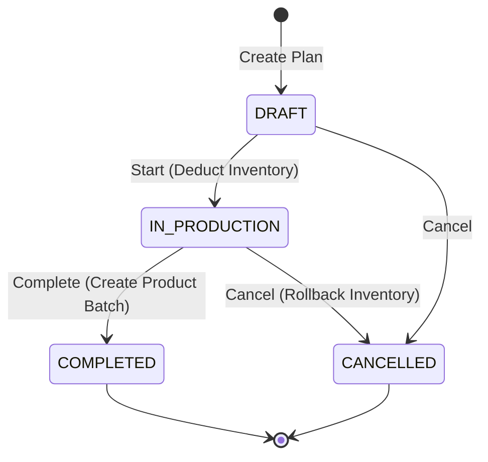

# Production & Batch System - Bakery Inventory Architecture

Tài liệu này đặc tả kiến trúc hệ thống sản xuất và quản lý tồn kho theo lô (Batch) tại Bếp Trung Tâm (Central Kitchen), tập trung vào quy trình vận hành tiệm bánh.

## 1) Quy tắc định danh và Phạm vi dữ liệu
Hệ thống hiện tại được tối ưu hóa cho ngành bánh:
- **ID Nguyên liệu**: Luôn bắt đầu bằng tiền tố `BAKE` (ví dụ: `BAKE001` - Bột mì).
- **ID Kế hoạch sản xuất**: Bắt đầu bằng `PLN` kèm ngày tháng (ví dụ: `PLN0423001`).
- **ID Lô thành phẩm**: Bắt đầu bằng `PB` (Product Batch).
- **ID Lô nguyên liệu**: Bắt đầu bằng `B-` hoặc `BOOST-`.

---

## 2) Quy trình Sản xuất (Production Lifecycle)

### 2.1) Lập kế hoạch (DRAFT)
- **API**: `POST /api/central-kitchen/production-plans`
- **Hành vi**:
    1. Kiểm tra công thức (Recipe) của sản phẩm.
    2. Chạy thuật toán **FEFO (First-Expiry-First-Out)** ảo để kiểm tra tồn kho nguyên liệu.
    3. Nếu đủ nguyên liệu, tạo kế hoạch ở trạng thái `DRAFT`.
    4. **Lưu ý**: Giai đoạn này chỉ là "giữ chỗ" (Reserve), chưa trừ tồn kho thật.

### 2.2) Kiểm tra nguyên liệu (Recipe Check)
- **API**: `GET /api/central-kitchen/production-plans/recipe-check?productId=...&quantity=...`
- **Mục đích**: Cho phép FE kiểm tra nhanh xem có đủ nguyên liệu để sản xuất mục tiêu hay không trước khi bấm tạo kế hoạch chính thức.

### 2.3) Bắt đầu sản xuất (IN_PRODUCTION)
- **API**: `PATCH /api/central-kitchen/production-plans/{planId}/start`
- **Hành vi**: 
    1. Trừ trực tiếp `remainingQuantity` của các lô nguyên liệu (`IngredientBatch`) đã được FEFO chỉ định.
    2. Trừ `totalQuantity` trong kho tổng (`KitchenInventory`).
    3. Chuyển trạng thái sang `IN_PRODUCTION`.
- **Thất bại**: Nếu tại thời điểm bấm start, tồn kho thực tế bị thay đổi (do kế hoạch khác dùng trước), hệ thống sẽ báo lỗi và yêu cầu tạo lại kế hoạch.

### 2.4) Hoàn thành sản xuất (COMPLETED)
- **API**: `PATCH /api/central-kitchen/production-plans/{planId}/complete`
- **Hành vi**:
    1. Yêu cầu nhập `expiryDate` cho thành phẩm.
    2. Chuyển trạng thái sang `COMPLETED`.
    3. Tự động sinh ra 1 **Lô thành phẩm (Product Batch)** mới với số lượng tương ứng.

### 2.5) Hủy kế hoạch (CANCELLED)
- **API**: `PATCH /api/central-kitchen/production-plans/{planId}/cancel`
- **Hành vi**:
    1. Nếu kế hoạch đang `IN_PRODUCTION`: Hệ thống tự động **Hoàn trả (Rollback)** số lượng nguyên liệu về đúng các lô ban đầu.
    2. Nếu đang `DRAFT`: Xóa các bản ghi dự kiến sử dụng (Reserve).

---

## 3) Quản lý Tồn kho & FEFO Tự động

### 3.1) Cơ chế FEFO (First-Expiry-First-Out)
Hệ thống ưu tiên sử dụng các lô hàng có **ngày hết hạn (`expiryDate`) gần nhất**. Cơ chế này áp dụng cho 2 công đoạn:
1. **Sản xuất**: Chọn lô nguyên liệu để làm bánh.
2. **Xuất hàng cho Cửa hàng**: Chọn lô thành phẩm để đóng gói đơn hàng.

### 3.2) Tự động trừ kho khi xử lý Đơn hàng (Order Sync)
Đây là điểm cực kỳ quan trọng trong kiến trúc mới:
- Khi Nhân viên bếp chuyển trạng thái đơn hàng sang **`PACKED_WAITING_SHIPPER`**:
    1. Hệ thống tự động quét các lô thành phẩm (`ProductBatch`) đang có trong kho của bếp.
    2. Áp dụng FEFO để trừ số lượng sản phẩm tương ứng trong đơn hàng.
    3. Giảm `remainingQuantity` của lô và cập nhật trạng thái lô nếu hết hàng (`DEPLETED`).
- **Lợi ích**: Đảm bảo số liệu tồn kho thành phẩm luôn khớp với thực tế vận hành mà không cần thao tác thủ công.

---

## 4) Danh sách API Quan trọng

### 4.1 Quản lý Nguyên liệu & Kho
- `GET /api/central-kitchen/inventory`: Xem tồn kho tổng hợp (Hỗ trợ lọc `lowStock=true`).
- `GET /api/central-kitchen/ingredient-batches`: Danh sách chi tiết từng lô nguyên liệu đang có.
- `POST /api/central-kitchen/ingredient-batches`: Nhập lô nguyên liệu mới vào kho.

### 4.2 Lập kế hoạch & Sản xuất
- `GET /api/central-kitchen/production-plans`: Danh sách kế hoạch (Hỗ trợ phân trang).
- `POST /api/central-kitchen/production-plans`: Tạo kế hoạch mới (Status `DRAFT`).
- `PATCH /api/central-kitchen/production-plans/{id}/start`: Bắt đầu (Trừ kho nguyên liệu).
- `PATCH /api/central-kitchen/production-plans/{id}/complete`: Hoàn tất (Tạo lô thành phẩm).

### 4.3 Quản lý Lô thành phẩm
- `GET /api/central-kitchen/product-batches`: Danh sách các lô bánh đã sản xuất thành công.
- `GET /api/central-kitchen/product-batches/{id}`: Xem chi tiết lô (bao gồm cả truy vết nguyên liệu - Traceability).

---

## 5) Sơ đồ Chuyển trạng thái (State Machine)

---

## 6) Ghi chú cho Frontend (FE Integration)
- **Auth**: Cần có quyền `PRODUCTION_PLAN_UPDATE` để gọi các lệnh `start/complete/cancel`.
- **Validation**: Luôn kiểm tra `sufficient` trong response của detail plan để cảnh báo người dùng nếu thiếu hàng.
- **Traceability**: Tại màn hình chi tiết lô thành phẩm, sử dụng mảng `ingredientBatchUsages` để hiển thị cho người dùng biết ổ bánh này được làm từ lô bột mì/trứng/bơ nào.
