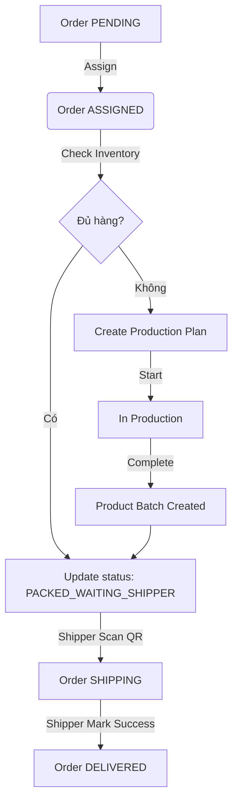

# Central Kitchen Staff API Master Documentation (FE Ready)

Tài liệu này cung cấp chi tiết toàn bộ Request/Response và các luồng nghiệp vụ (Flow) chuẩn để Frontend có thể tích hợp ngay lập tức (Ready to connect).

---

## 1. Thông tin chung
- **Base URL**: `/api/central-kitchen`
- **Auth**: `Authorization: Bearer <JWT_TOKEN>`
- **Response Format**: Toàn bộ dữ liệu được đóng gói trong `@ApiResponse`:
```json
{
  "statusCode": 200,
  "message": "Thành công",
  "data": { ... }
}
```

---

## 2. Luồng Nghiệp vụ 1: Xử lý Đơn hàng (Order Fulfillment)

Luồng này mô tả cách nhân viên bếp nhận đơn từ Cửa hàng và đóng gói hàng.

### Bước 1: Xem danh sách đơn đang chờ (`PENDING`)
- **API**: `GET /orders?status=PENDING&page=0&size=20`
- **Response**:
```json
{
  "data": {
    "content": [
      {
        "id": "ORD0423001",
        "storeName": "Store District 1",
        "status": "PENDING",
        "requestedDate": "2026-04-23",
        "total": 500000.0,
        "createdAt": "2026-04-23T10:00:00"
      }
    ],
    "totalElements": 1,
    "totalPages": 1
  }
}
```

### Bước 2: Nhận đơn về bếp của mình
- **API**: `PATCH /orders/ORD0423001/assign`
- **Hành vi**: Chuyển trạng thái sang `ASSIGNED`. Backend tự gán `kitchenId` của user hiện tại vào đơn.

### Bước 3: Đóng gói xong (Trừ kho thành phẩm tự động)
- **API**: `PATCH /orders/ORD0423001/status`
- **Request Body**:
```json
{
  "status": "PACKED_WAITING_SHIPPER",
  "notes": "Đã đóng gói đủ 10 ổ bánh mì sừng bò"
}
```
- **Hành vi quan trọng**: Tại bước này, hệ thống sẽ tự động quét các lô thành phẩm (`ProductBatch`) của bếp theo **FEFO** để trừ hàng.
- **Nếu thiếu hàng (Response 400)**:
```json
{
  "statusCode": 400,
  "message": "Không đủ tồn kho thành phẩm cho sản phẩm BAKE001. Cần: 10, Còn: 2",
  "data": null
}
```

---

## 3. Luồng Nghiệp vụ 2: Sản xuất & Quản lý lô (Production & Batch)

Sử dụng khi kho thành phẩm hết hàng hoặc cần làm bánh theo kế hoạch.

### Bước 1: Kiểm tra nhanh nguyên liệu (Pre-check)
- **API**: `GET /production-plans/recipe-check?productId=PROD001&quantity=50`
- **Response**:
```json
{
  "data": {
    "productId": "PROD001",
    "productName": "Bánh Mì Sừng Bò",
    "requestedQuantity": 50,
    "hasEnough": true,
    "ingredients": [
      {
        "name": "Bột mì BAKE",
        "required": 5.0,
        "available": 100.0,
        "sufficient": true
      }
    ]
  }
}
```

### Bước 2: Tạo kế hoạch sản xuất
- **API**: `POST /production-plans`
- **Request Body**:
```json
{
  "productId": "PROD001",
  "quantity": 50,
  "startDate": "2026-04-23T14:00:00",
  "endDate": "2026-04-23T18:00:00",
  "notes": "Làm bánh bổ sung cho đơn hàng ORD0423001"
}
```
- **Response**: Trả về `ProductionPlanResponse` với `id: "PLN0423005"`, trạng thái `DRAFT`.

### Bước 3: Bắt đầu làm (Trừ kho nguyên liệu thật)
- **API**: `PATCH /production-plans/PLN0423005/start`
- **Hành vi**: Trừ số lượng bột, bơ, trứng... từ các lô nguyên liệu có hạn dùng gần nhất. Trạng thái chuyển sang `IN_PRODUCTION`.

### Bước 4: Hoàn tất (Nhập bánh vào kho)
- **API**: `PATCH /production-plans/PLN0423005/complete`
- **Request Body**:
```json
{
  "expiryDate": "2026-04-30",
  "notes": "Bánh ra lò thơm ngon, đúng tiêu chuẩn."
}
```
- **Hành vi**: Trạng thái `COMPLETED`. Hệ thống sinh ra một lô thành phẩm mới (`PB...`) để sẵn sàng bán/giao.

---

## 4. Chi tiết các Object DTO quan trọng

### 4.1 ProductionPlanResponse (Chi tiết kế hoạch)
Dùng cho màn hình chi tiết để FE hiển thị bảng nguyên liệu (Traceability).
```json
{
  "id": "PLN0423005",
  "productName": "Bánh Mì Sừng Bò",
  "quantity": 50,
  "unit": "ổ",
  "status": "IN_PRODUCTION",
  "ingredients": [
    {
      "ingredientId": "BAKE001",
      "ingredientName": "Bột mì đa dụng",
      "requiredQuantity": 10.0,
      "availableQuantity": 150.0,
      "unit": "kg",
      "sufficient": true
    }
  ]
}
```

### 4.2 IngredientBatchResponse (Lô nguyên liệu)
Dùng cho màn hình Quản lý kho nguyên liệu.
```json
{
  "id": "B-12345",
  "batchNo": "LOT- tepung-01",
  "ingredientName": "Bột mì",
  "remainingQuantity": 45.5,
  "unit": "kg",
  "expiryDate": "2026-12-31",
  "status": "ACTIVE",
  "nearExpiry": false
}
```

### 4.3 BatchResponse (Lô thành phẩm)
Dùng cho màn hình Quản lý lô bánh đã sản xuất.
```json
{
  "id": "PB260423001",
  "productName": "Bánh Mì Sừng Bò",
  "quantity": 100,
  "remainingQuantity": 80,
  "status": "AVAILABLE",
  "expiryDate": "2026-04-30",
  "ingredientBatchUsages": [
    {
      "batchNo": "BOOST-12345",
      "ingredientName": "Bột mì",
      "quantityUsed": 20.0
    }
  ]
}
```

---

## 5. Danh sách Permission tương ứng
Frontend có thể dùng thông tin này để ẩn/hiện các nút bấm trên UI:
- **Nút "Nhận đơn"**: Cần `ORDER_ASSIGN`.
- **Nút "Cập nhật đơn"**: Cần `ORDER_STATUS_UPDATE`.
- **Nút "Tạo kế hoạch"**: Cần `PRODUCTION_PLAN_CREATE`.
- **Nút "Bắt đầu/Hoàn tất kế hoạch"**: Cần `PRODUCTION_PLAN_UPDATE`.
- **Nút "Nhập kho"**: Cần `KITCHEN_INVENTORY_CREATE`.

---

## 6. Sơ đồ Luồng Công việc (Workflow)



---

**Ghi chú cuối**: 
- Các trường ngày tháng sử dụng định dạng ISO: `yyyy-MM-dd'T'HH:mm:ss`.
- Khi `statusCode` khác 200, hãy hiển thị nội dung `message` cho người dùng vì đó là lỗi nghiệp vụ đã được Backend xử lý.
